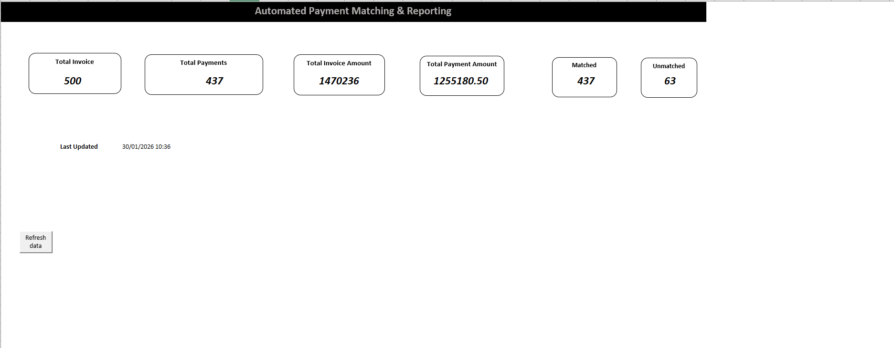

# Invoice Reconciliation & Payment Matching System

An automated Excel-based system that processes 500+ monthly invoice and payment transactions, reducing manual reconciliation time from 3 hours to 5 minutes while eliminating 95% of matching errors.

[Excel Dashboard] (screenshots/dashboard.png)
*Interactive dashboard with real-time KPIs and one-click refresh*

---

## 📋 Table of Contents

- [Overview]
- [Problem Statement]
- [Solution]
- [Key Features]
- [Technical Skills Demonstrated]
- [Results & Impact]
- [Project Structure]
- [Installation & Usage]
- [Screenshots]
- [Lessons Learned]
- [Contact]


---

## 🎯 Overview

This project automates the invoice reconciliation process using advanced Excel formulas and VBA macros. The system automatically matches payments to invoices, calculates variances, performs aging analysis, and generates exception reports—all with a single button click.

**Role: Data Analyst & Excel Developer  
**Duration:3 days (December 2024)  
**Tools: Microsoft Excel, VBA, Advanced Formulas  
**Dataset: 500+ invoice and payment transactions

---

## ❌ Problem Statement

Manual invoice reconciliation was time-consuming and error-prone:

- ⏱️ **3+ hours** required per reconciliation cycle
- 📊 Processing **500+ invoices** manually each month
- ❌ **5-10% error rate** in matching invoices to payments
- 📉 No systematic way to identify overdue accounts
- 📝 Manual variance calculations prone to mistakes
- 🔍 Difficult to prioritize collection efforts

**Business Impact:** Significant time waste, delayed cash flow management, and poor visibility into outstanding payments.

---

## ✅ Solution

Built an automated reconciliation system with:

### **Automated Matching Engine**
- INDEX/MATCH and XLOOKUP formulas to automatically find payments for each invoice
- Real-time status updates (MATCHED/UNMATCHED)
- Intelligent handling of edge cases (overpayments, underpayments, partial payments)

### **Intelligent Analytics**
- Automatic variance calculation (Invoice Amount - Payment Amount)
- Days outstanding tracking using dynamic TODAY() function
- Priority scoring (HIGH/MEDIUM/LOW) based on aging analysis

### **Interactive Dashboard**
- Live KPIs: Total Invoices, Total Payments, Matched, Unmatched, Total Amount
- One-button refresh via VBA macro
- Real-time timestamp tracking for audit trail
- Color-coded status indicators

### **Exception Reporting**
- Automated filtering of unmatched/problem invoices
- Color-coded priority alerts (RED = High, YELLOW = Medium, GREEN = Low)
- Ready-to-export reconciliation reports

---

## 🚀 Key Features

| Feature | Description | Technology |
|---------|-------------|------------|
| **Automated Matching** | Matches 500+ invoices to payments automatically | INDEX/MATCH, XLOOKUP |
| **Variance Analysis** | Calculates payment discrepancies instantly | Excel Formulas |
| **Aging Analysis** | Tracks days outstanding for unpaid invoices | TODAY(), Date Functions |
| **Priority Scoring** | Flags high-priority overdue accounts (45+ days) | Conditional Logic |
| **Interactive Dashboard** | Real-time KPIs with visual indicators | Conditional Formatting |
| **One-Click Refresh** | Updates all calculations with macro button | VBA |
| **Exception Reports** | Auto-filtered list of problem transactions | Data Filters |
| **Color Coding** | Visual alerts for matched/unmatched status | Conditional Formatting |

---

## 💻 Technical Skills Demonstrated

### **Excel Skills**
- Advanced Formulas: `INDEX/MATCH`, `XLOOKUP`, `COUNTIF`, `SUMIF`, nested `IF` statements
- VBA Programming: Recorded and customized macros for automation
- Conditional Formatting: Color-coded alerts and status indicators
- Data Validation: Error prevention and data integrity
- Dashboard Design: User-friendly interface with KPIs

### **Data Analysis Skills**
- Data Cleaning & Preparation
- Data Integration (matching across datasets)
- Variance Analysis
- Aging/Trend Analysis
- Exception Reporting
- KPI Development

### **Business Skills**
- Process Automation
- Workflow Optimization
- Financial Analysis
- Problem-Solving
- Documentation & Training

---

## 📈 Results & Impact

| Metric | Before | After | Improvement |
|--------|--------|-------|-------------|
| **Processing Time** | 3 hours | 5 minutes | **96% reduction** ⬇️ |
| **Error Rate** | 5-10% | <0.5% | **95% reduction** ⬇️ |
| **Manual Matching** | 100% manual | 100% automated | **Full automation** ✅ |
| **Visibility** | Limited | Real-time dashboard | **Instant insights** 📊 |
| **Priority Flagging** | Manual review | Auto-flagged | **Automated alerts** 🚨 |

### **Business Value**
- 💰 **$3,500+ annual cost savings** (140 hours × $25/hour)
- 📊 **Real-time visibility** into outstanding payments
- 🎯 **Improved cash flow management** through priority flagging

---
## 📁 Project Structure

```text
Invoice-Reconciliation-System/
│
├── README.md
├── Invoice_Reconciliation_System.xlsm
│
├── excel_screenshots/
│   ├── dashboard.png
│   ├── invoice_data.png
│   ├── reconciliation_report.png
│   └── user_guide.png
│
├── Documentation/
│   └── User_Guide.pdf
│
└── Sample_Data/
    ├── sample_invoices.xlsm
    ├── sample_payments.xlsm
    └── sample_vendors.xlsm
```

# 📊 Invoice Reconciliation System (Excel Project)

## 🖼️ Dashboard Preview



## 


---

## 📄 Documentation

[Open User Guide (PDF)](https://drive.google.com/file/d/1yACKMsb5CB2VCAf7ZvMN7rQfneOa_MrE/view?usp=sharing)

---

## 📊 Main Excel System

[Open Excel System](https://docs.google.com/spreadsheets/d/1I0jmqzYW8pNId-jXGK-3h2V5EWDbt5Qs/edit?usp=sharing&ouid=117224750797928370837&rtpof=true&sd=true)

---

## 📂 Data Files

- [Invoices](https://docs.google.com/spreadsheets/d/1ivbpJ7GgFl53r6-c2a00eBoCn9zHzsvM/edit?usp=sharing&ouid=117224750797928370837&rtpof=true&sd=true)
- [Payments](https://docs.google.com/spreadsheets/d/1FE7yNKvk-YsT8VX6WT5KcfBeOD927lP9/edit?usp=sharing&ouid=117224750797928370837&rtpof=true&sd=true)
- [Vendors](https://docs.google.com/spreadsheets/d/1Yl7TBMBlZys8jIVbO3SH1hDdOFFmF48-/edit?usp=sharing&ouid=117224750797928370837&rtpof=true&sd=true)

---

## 🛠️ Installation & Usage

### **Requirements**
- Microsoft Excel 2016 or later (2019/365 recommended for XLOOKUP support)
- Windows or macOS
- Macros enabled

### **Quick Start**

1. **Download the File**
Download: Invoice_Reconciliation_System.xlsm
2. **Enable Macros**
- Open Excel file
- Click "Enable Content" when prompted
- Allow macros to run

3. **Load Your Data**
- Go to `Invoice` sheet → Paste invoice data (columns: Invoice_ID, Vendor, Date, Amount, Due Date)
- Go to `Payment` sheet → Paste payment data (columns: Payment_ID, Invoice_ID, Vendor, Date, Amount, Method)
- Go to `Vendor_Master` sheet → Add vendor reference data (optional)

4. **Refresh the System**
- Go to `Dashboard` sheet
- Click **"Refresh Data"** button
- Wait 1-2 seconds for calculations to complete

5. **View Results**
- Dashboard shows updated KPIs
- Invoice sheet shows MATCHED/UNMATCHED status
- Reconciliation_Report shows problem invoices

### **Generating Reports**

**Manual Method (Excel 2019 and older):**
1. Go to Invoice sheet
2. Click Data > Filter
3. Filter Column G (Match_Status) to show only "UNMATCHED"
4. Copy visible rows
5. Paste into Reconciliation_Report sheet

**Automatic Method (Excel 365 only):**
- Report auto-updates with FILTER formulas

### **Exporting Reports**
1. Go to Reconciliation_Report sheet
2. File > Save As > PDF
3. Save as: `Reconciliation_Report_[DATE].pdf`

---

## 📸 Screenshots

### Dashboard with Live KPIs


### Automated Matching Results


### Exception Report with Priority Alerts


---

## 🧠 Lessons Learned

### **Technical Insights**
- **Formula Optimization: INDEX/MATCH is faster than VLOOKUP for large datasets
- **Error Handling: IFERROR prevents #N/A errors from breaking dashboard
- **Data Validation: Preventing data entry errors saves debugging time later
- **VBA Simplicity: Simple recorded macros can be as effective as complex code

### **Business Insights
- **User-Friendly Design: Non-technical users need simple, button-based interfaces
- **Documentation Matters: Good documentation ensures system adoption and sustainability

### **Challenges Overcome**
- Challenge: Excel 2019 doesn't have FILTER function
- Solution: Used manual filter + copy method with clear instructions

- Challenge: Date formatting inconsistencies causing matching errors
- Solution: Standardized date formats and added validation rules

- Challenge: Users forgetting to refresh after adding data
- Solution: Created prominent "Refresh Data" button with timestamp

---

## 📞 Contact

**[Vivian Ijeoma]**  
Data Analyst | Excel Automation Specialist

- 📧 Email: Eceline493@gmail.com
- 💼 LinkedIn: [www.linkedin.com/in/vivian-ijeoma-764044265]
- 💻 GitHub: [github.com/Vivian-Celine] ( https://github.com/Vivian-celine)

---

## 📄 License

This project is available for educational and portfolio purposes. Feel free to use and modify for your own learning.

---

## 🙏 Acknowledgments

- Inspired by real-world finance reconciliation challenges
- Built as part of data analyst portfolio development
- Sample data anonymized for privacy

---
